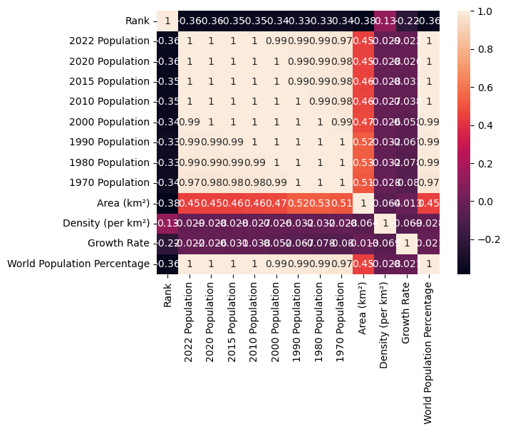
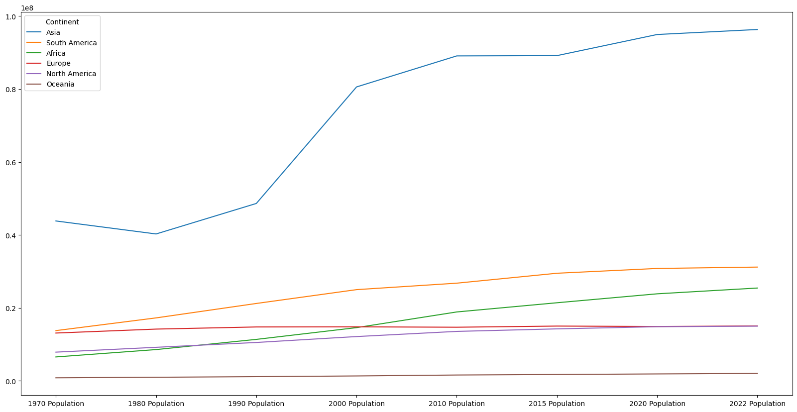
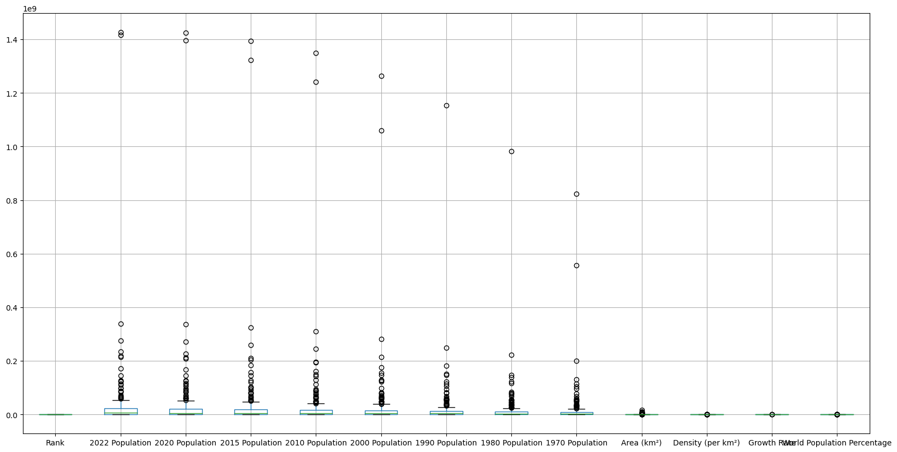

# Exploratory-Data-Analysis-EDA-in-Pandas

```python
# import libraries
import pandas as pd
import seaborn as sns
import matplotlib.pyplot as plt
```


```python
# Read a CSV file into a pandas DataFrame.
df = pd.read_csv(r"C:\Users\Derek Winters\Desktop\world_population.csv")

# Display the contents of the DataFrame.
df
```


<div>
<style scoped>
    .dataframe tbody tr th:only-of-type {
        vertical-align: middle;
    }

    .dataframe tbody tr th {
        vertical-align: top;
    }

    .dataframe thead th {
        text-align: right;
    }
</style>
<table border="1" class="dataframe">
  <thead>
    <tr style="text-align: right;">
      <th></th>
      <th>Rank</th>
      <th>CCA3</th>
      <th>Country</th>
      <th>Capital</th>
      <th>Continent</th>
      <th>2022 Population</th>
      <th>2020 Population</th>
      <th>2015 Population</th>
      <th>2010 Population</th>
      <th>2000 Population</th>
      <th>1990 Population</th>
      <th>1980 Population</th>
      <th>1970 Population</th>
      <th>Area (km²)</th>
      <th>Density (per km²)</th>
      <th>Growth Rate</th>
      <th>World Population Percentage</th>
    </tr>
  </thead>
  <tbody>
    <tr>
      <th>0</th>
      <td>36</td>
      <td>AFG</td>
      <td>Afghanistan</td>
      <td>Kabul</td>
      <td>Asia</td>
      <td>41128771.0</td>
      <td>38972230.0</td>
      <td>33753499.0</td>
      <td>28189672.0</td>
      <td>19542982.0</td>
      <td>10694796.0</td>
      <td>12486631.0</td>
      <td>10752971.0</td>
      <td>652230.0</td>
      <td>63.0587</td>
      <td>1.0257</td>
      <td>0.52</td>
    </tr>
    <tr>
      <th>1</th>
      <td>138</td>
      <td>ALB</td>
      <td>Albania</td>
      <td>Tirana</td>
      <td>Europe</td>
      <td>2842321.0</td>
      <td>2866849.0</td>
      <td>2882481.0</td>
      <td>2913399.0</td>
      <td>3182021.0</td>
      <td>3295066.0</td>
      <td>2941651.0</td>
      <td>2324731.0</td>
      <td>28748.0</td>
      <td>98.8702</td>
      <td>0.9957</td>
      <td>0.04</td>
    </tr>
    <tr>
      <th>2</th>
      <td>34</td>
      <td>DZA</td>
      <td>Algeria</td>
      <td>Algiers</td>
      <td>Africa</td>
      <td>44903225.0</td>
      <td>43451666.0</td>
      <td>39543154.0</td>
      <td>35856344.0</td>
      <td>30774621.0</td>
      <td>25518074.0</td>
      <td>18739378.0</td>
      <td>13795915.0</td>
      <td>2381741.0</td>
      <td>18.8531</td>
      <td>1.0164</td>
      <td>0.56</td>
    </tr>
    <tr>
      <th>3</th>
      <td>213</td>
      <td>ASM</td>
      <td>American Samoa</td>
      <td>Pago Pago</td>
      <td>Oceania</td>
      <td>44273.0</td>
      <td>46189.0</td>
      <td>51368.0</td>
      <td>54849.0</td>
      <td>58230.0</td>
      <td>47818.0</td>
      <td>32886.0</td>
      <td>27075.0</td>
      <td>199.0</td>
      <td>222.4774</td>
      <td>0.9831</td>
      <td>0.00</td>
    </tr>
    <tr>
      <th>4</th>
      <td>203</td>
      <td>AND</td>
      <td>Andorra</td>
      <td>Andorra la Vella</td>
      <td>Europe</td>
      <td>79824.0</td>
      <td>77700.0</td>
      <td>71746.0</td>
      <td>71519.0</td>
      <td>66097.0</td>
      <td>53569.0</td>
      <td>35611.0</td>
      <td>19860.0</td>
      <td>468.0</td>
      <td>170.5641</td>
      <td>1.0100</td>
      <td>0.00</td>
    </tr>
    <tr>
      <th>...</th>
      <td>...</td>
      <td>...</td>
      <td>...</td>
      <td>...</td>
      <td>...</td>
      <td>...</td>
      <td>...</td>
      <td>...</td>
      <td>...</td>
      <td>...</td>
      <td>...</td>
      <td>...</td>
      <td>...</td>
      <td>...</td>
      <td>...</td>
      <td>...</td>
      <td>...</td>
    </tr>
    <tr>
      <th>229</th>
      <td>226</td>
      <td>WLF</td>
      <td>Wallis and Futuna</td>
      <td>Mata-Utu</td>
      <td>Oceania</td>
      <td>11572.0</td>
      <td>11655.0</td>
      <td>12182.0</td>
      <td>13142.0</td>
      <td>14723.0</td>
      <td>13454.0</td>
      <td>11315.0</td>
      <td>9377.0</td>
      <td>142.0</td>
      <td>81.4930</td>
      <td>0.9953</td>
      <td>0.00</td>
    </tr>
    <tr>
      <th>230</th>
      <td>172</td>
      <td>ESH</td>
      <td>Western Sahara</td>
      <td>El Aaiún</td>
      <td>Africa</td>
      <td>575986.0</td>
      <td>556048.0</td>
      <td>491824.0</td>
      <td>413296.0</td>
      <td>270375.0</td>
      <td>178529.0</td>
      <td>116775.0</td>
      <td>76371.0</td>
      <td>266000.0</td>
      <td>2.1654</td>
      <td>1.0184</td>
      <td>0.01</td>
    </tr>
    <tr>
      <th>231</th>
      <td>46</td>
      <td>YEM</td>
      <td>Yemen</td>
      <td>Sanaa</td>
      <td>Asia</td>
      <td>33696614.0</td>
      <td>32284046.0</td>
      <td>28516545.0</td>
      <td>24743946.0</td>
      <td>18628700.0</td>
      <td>13375121.0</td>
      <td>9204938.0</td>
      <td>6843607.0</td>
      <td>527968.0</td>
      <td>63.8232</td>
      <td>1.0217</td>
      <td>0.42</td>
    </tr>
    <tr>
      <th>232</th>
      <td>63</td>
      <td>ZMB</td>
      <td>Zambia</td>
      <td>Lusaka</td>
      <td>Africa</td>
      <td>20017675.0</td>
      <td>18927715.0</td>
      <td>NaN</td>
      <td>13792086.0</td>
      <td>9891136.0</td>
      <td>7686401.0</td>
      <td>5720438.0</td>
      <td>4281671.0</td>
      <td>752612.0</td>
      <td>26.5976</td>
      <td>1.0280</td>
      <td>0.25</td>
    </tr>
    <tr>
      <th>233</th>
      <td>74</td>
      <td>ZWE</td>
      <td>Zimbabwe</td>
      <td>Harare</td>
      <td>Africa</td>
      <td>16320537.0</td>
      <td>15669666.0</td>
      <td>14154937.0</td>
      <td>12839771.0</td>
      <td>11834676.0</td>
      <td>10113893.0</td>
      <td>7049926.0</td>
      <td>5202918.0</td>
      <td>390757.0</td>
      <td>41.7665</td>
      <td>1.0204</td>
      <td>0.20</td>
    </tr>
  </tbody>
</table>
<p>234 rows × 17 columns</p>
</div>


```python
# Set the display format for floating-point numbers in the DataFrame to two decimal places.

pd.set_option('display.float_format', lambda x: '%.2f' % x)
```


```python
# Display concise information about the DataFrame, including data types and memory usage.

df.info()
```

    <class 'pandas.core.frame.DataFrame'>
    RangeIndex: 234 entries, 0 to 233
    Data columns (total 17 columns):
     #   Column                       Non-Null Count  Dtype  
    ---  ------                       --------------  -----  
     0   Rank                         234 non-null    int64  
     1   CCA3                         234 non-null    object 
     2   Country                      234 non-null    object 
     3   Capital                      234 non-null    object 
     4   Continent                    234 non-null    object 
     5   2022 Population              230 non-null    float64
     6   2020 Population              233 non-null    float64
     7   2015 Population              230 non-null    float64
     8   2010 Population              227 non-null    float64
     9   2000 Population              227 non-null    float64
     10  1990 Population              229 non-null    float64
     11  1980 Population              229 non-null    float64
     12  1970 Population              230 non-null    float64
     13  Area (km²)                   232 non-null    float64
     14  Density (per km²)            230 non-null    float64
     15  Growth Rate                  232 non-null    float64
     16  World Population Percentage  234 non-null    float64
    dtypes: float64(12), int64(1), object(4)
    memory usage: 31.2+ KB
    


```python
# Generate descriptive statistics of the DataFrame, including count, mean, std deviation, min, 25th, 50th, and 75th percentiles, and max

df.describe()
```


<div>
<style scoped>
    .dataframe tbody tr th:only-of-type {
        vertical-align: middle;
    }

    .dataframe tbody tr th {
        vertical-align: top;
    }

    .dataframe thead th {
        text-align: right;
    }
</style>
<table border="1" class="dataframe">
  <thead>
    <tr style="text-align: right;">
      <th></th>
      <th>Rank</th>
      <th>2022 Population</th>
      <th>2020 Population</th>
      <th>2015 Population</th>
      <th>2010 Population</th>
      <th>2000 Population</th>
      <th>1990 Population</th>
      <th>1980 Population</th>
      <th>1970 Population</th>
      <th>Area (km²)</th>
      <th>Density (per km²)</th>
      <th>Growth Rate</th>
      <th>World Population Percentage</th>
    </tr>
  </thead>
  <tbody>
    <tr>
      <th>count</th>
      <td>234.00</td>
      <td>230.00</td>
      <td>233.00</td>
      <td>230.00</td>
      <td>227.00</td>
      <td>227.00</td>
      <td>229.00</td>
      <td>229.00</td>
      <td>230.00</td>
      <td>232.00</td>
      <td>230.00</td>
      <td>232.00</td>
      <td>234.00</td>
    </tr>
    <tr>
      <th>mean</th>
      <td>117.50</td>
      <td>34632250.88</td>
      <td>33600710.95</td>
      <td>32066004.16</td>
      <td>30270164.48</td>
      <td>26840495.26</td>
      <td>19330463.93</td>
      <td>16282884.78</td>
      <td>15866499.13</td>
      <td>581663.75</td>
      <td>456.81</td>
      <td>1.01</td>
      <td>0.43</td>
    </tr>
    <tr>
      <th>std</th>
      <td>67.69</td>
      <td>137889172.44</td>
      <td>135873196.61</td>
      <td>131507146.34</td>
      <td>126074183.54</td>
      <td>113352454.57</td>
      <td>81309624.96</td>
      <td>69345465.54</td>
      <td>68355859.75</td>
      <td>1769133.06</td>
      <td>2083.74</td>
      <td>0.01</td>
      <td>1.71</td>
    </tr>
    <tr>
      <th>min</th>
      <td>1.00</td>
      <td>510.00</td>
      <td>520.00</td>
      <td>564.00</td>
      <td>596.00</td>
      <td>651.00</td>
      <td>700.00</td>
      <td>733.00</td>
      <td>752.00</td>
      <td>1.00</td>
      <td>0.03</td>
      <td>0.91</td>
      <td>0.00</td>
    </tr>
    <tr>
      <th>25%</th>
      <td>59.25</td>
      <td>419738.50</td>
      <td>406471.00</td>
      <td>394295.00</td>
      <td>382726.50</td>
      <td>329470.00</td>
      <td>261928.00</td>
      <td>223752.00</td>
      <td>145880.50</td>
      <td>2567.25</td>
      <td>36.60</td>
      <td>1.00</td>
      <td>0.01</td>
    </tr>
    <tr>
      <th>50%</th>
      <td>117.50</td>
      <td>5762857.00</td>
      <td>5456681.00</td>
      <td>5244415.00</td>
      <td>4889741.00</td>
      <td>4491202.00</td>
      <td>3785847.00</td>
      <td>3135123.00</td>
      <td>2511718.00</td>
      <td>77141.00</td>
      <td>95.35</td>
      <td>1.01</td>
      <td>0.07</td>
    </tr>
    <tr>
      <th>75%</th>
      <td>175.75</td>
      <td>22653719.00</td>
      <td>21522626.00</td>
      <td>19730853.75</td>
      <td>16825852.50</td>
      <td>15625467.00</td>
      <td>11882762.00</td>
      <td>9817257.00</td>
      <td>8817329.00</td>
      <td>414643.25</td>
      <td>236.88</td>
      <td>1.02</td>
      <td>0.28</td>
    </tr>
    <tr>
      <th>max</th>
      <td>234.00</td>
      <td>1425887337.00</td>
      <td>1424929781.00</td>
      <td>1393715448.00</td>
      <td>1348191368.00</td>
      <td>1264099069.00</td>
      <td>1153704252.00</td>
      <td>982372466.00</td>
      <td>822534450.00</td>
      <td>17098242.00</td>
      <td>23172.27</td>
      <td>1.07</td>
      <td>17.88</td>
    </tr>
  </tbody>
</table>
</div>


```python
# Check for missing values in each column of the DataFrame and sum the count of null values.

df.isnull().sum()
```


    Rank                           0
    CCA3                           0
    Country                        0
    Capital                        0
    Continent                      0
    2022 Population                4
    2020 Population                1
    2015 Population                4
    2010 Population                7
    2000 Population                7
    1990 Population                5
    1980 Population                5
    1970 Population                4
    Area (km²)                     2
    Density (per km²)              4
    Growth Rate                    2
    World Population Percentage    0
    dtype: int64


```python
# Count the number of unique values in each column of the DataFrame.

df.nunique()
```


    Rank                           234
    CCA3                           234
    Country                        234
    Capital                        234
    Continent                        6
    2022 Population                230
    2020 Population                233
    2015 Population                230
    2010 Population                227
    2000 Population                227
    1990 Population                229
    1980 Population                229
    1970 Population                230
    Area (km²)                     231
    Density (per km²)              230
    Growth Rate                    178
    World Population Percentage     70
    dtype: int64


```python
# Sort the DataFrame by the 'World Population Percentage' column in descending order and display the top 10 rows.

df.sort_values(by="World Population Percentage", ascending=False).head(10)
```


<div>
<style scoped>
    .dataframe tbody tr th:only-of-type {
        vertical-align: middle;
    }

    .dataframe tbody tr th {
        vertical-align: top;
    }

    .dataframe thead th {
        text-align: right;
    }
</style>
<table border="1" class="dataframe">
  <thead>
    <tr style="text-align: right;">
      <th></th>
      <th>Rank</th>
      <th>CCA3</th>
      <th>Country</th>
      <th>Capital</th>
      <th>Continent</th>
      <th>2022 Population</th>
      <th>2020 Population</th>
      <th>2015 Population</th>
      <th>2010 Population</th>
      <th>2000 Population</th>
      <th>1990 Population</th>
      <th>1980 Population</th>
      <th>1970 Population</th>
      <th>Area (km²)</th>
      <th>Density (per km²)</th>
      <th>Growth Rate</th>
      <th>World Population Percentage</th>
    </tr>
  </thead>
  <tbody>
    <tr>
      <th>41</th>
      <td>1</td>
      <td>CHN</td>
      <td>China</td>
      <td>Beijing</td>
      <td>Asia</td>
      <td>1425887337.00</td>
      <td>1424929781.00</td>
      <td>1393715448.00</td>
      <td>1348191368.00</td>
      <td>1264099069.00</td>
      <td>1153704252.00</td>
      <td>982372466.00</td>
      <td>822534450.00</td>
      <td>9706961.00</td>
      <td>146.89</td>
      <td>1.00</td>
      <td>17.88</td>
    </tr>
    <tr>
      <th>92</th>
      <td>2</td>
      <td>IND</td>
      <td>India</td>
      <td>New Delhi</td>
      <td>Asia</td>
      <td>1417173173.00</td>
      <td>1396387127.00</td>
      <td>1322866505.00</td>
      <td>1240613620.00</td>
      <td>1059633675.00</td>
      <td>NaN</td>
      <td>NaN</td>
      <td>557501301.00</td>
      <td>3287590.00</td>
      <td>431.07</td>
      <td>1.01</td>
      <td>17.77</td>
    </tr>
    <tr>
      <th>221</th>
      <td>3</td>
      <td>USA</td>
      <td>United States</td>
      <td>Washington, D.C.</td>
      <td>North America</td>
      <td>338289857.00</td>
      <td>335942003.00</td>
      <td>324607776.00</td>
      <td>311182845.00</td>
      <td>282398554.00</td>
      <td>248083732.00</td>
      <td>223140018.00</td>
      <td>200328340.00</td>
      <td>9372610.00</td>
      <td>36.09</td>
      <td>1.00</td>
      <td>4.24</td>
    </tr>
    <tr>
      <th>93</th>
      <td>4</td>
      <td>IDN</td>
      <td>Indonesia</td>
      <td>Jakarta</td>
      <td>Asia</td>
      <td>275501339.00</td>
      <td>271857970.00</td>
      <td>259091970.00</td>
      <td>244016173.00</td>
      <td>214072421.00</td>
      <td>182159874.00</td>
      <td>148177096.00</td>
      <td>115228394.00</td>
      <td>1904569.00</td>
      <td>144.65</td>
      <td>1.01</td>
      <td>3.45</td>
    </tr>
    <tr>
      <th>156</th>
      <td>5</td>
      <td>PAK</td>
      <td>Pakistan</td>
      <td>Islamabad</td>
      <td>Asia</td>
      <td>235824862.00</td>
      <td>227196741.00</td>
      <td>210969298.00</td>
      <td>194454498.00</td>
      <td>154369924.00</td>
      <td>115414069.00</td>
      <td>80624057.00</td>
      <td>59290872.00</td>
      <td>881912.00</td>
      <td>267.40</td>
      <td>1.02</td>
      <td>2.96</td>
    </tr>
    <tr>
      <th>149</th>
      <td>6</td>
      <td>NGA</td>
      <td>Nigeria</td>
      <td>Abuja</td>
      <td>Africa</td>
      <td>218541212.00</td>
      <td>208327405.00</td>
      <td>183995785.00</td>
      <td>160952853.00</td>
      <td>122851984.00</td>
      <td>95214257.00</td>
      <td>72951439.00</td>
      <td>55569264.00</td>
      <td>923768.00</td>
      <td>236.58</td>
      <td>1.02</td>
      <td>2.74</td>
    </tr>
    <tr>
      <th>27</th>
      <td>7</td>
      <td>BRA</td>
      <td>Brazil</td>
      <td>Brasilia</td>
      <td>South America</td>
      <td>215313498.00</td>
      <td>213196304.00</td>
      <td>205188205.00</td>
      <td>196353492.00</td>
      <td>175873720.00</td>
      <td>150706446.00</td>
      <td>122288383.00</td>
      <td>96369875.00</td>
      <td>8515767.00</td>
      <td>25.28</td>
      <td>1.00</td>
      <td>2.70</td>
    </tr>
    <tr>
      <th>16</th>
      <td>8</td>
      <td>BGD</td>
      <td>Bangladesh</td>
      <td>Dhaka</td>
      <td>Asia</td>
      <td>171186372.00</td>
      <td>167420951.00</td>
      <td>157830000.00</td>
      <td>148391139.00</td>
      <td>129193327.00</td>
      <td>107147651.00</td>
      <td>83929765.00</td>
      <td>67541860.00</td>
      <td>147570.00</td>
      <td>1160.04</td>
      <td>1.01</td>
      <td>2.15</td>
    </tr>
    <tr>
      <th>171</th>
      <td>9</td>
      <td>RUS</td>
      <td>Russia</td>
      <td>Moscow</td>
      <td>Europe</td>
      <td>144713314.00</td>
      <td>145617329.00</td>
      <td>144668389.00</td>
      <td>143242599.00</td>
      <td>146844839.00</td>
      <td>148005704.00</td>
      <td>138257420.00</td>
      <td>130093010.00</td>
      <td>17098242.00</td>
      <td>8.46</td>
      <td>1.00</td>
      <td>1.81</td>
    </tr>
    <tr>
      <th>131</th>
      <td>10</td>
      <td>MEX</td>
      <td>Mexico</td>
      <td>Mexico City</td>
      <td>North America</td>
      <td>127504125.00</td>
      <td>125998302.00</td>
      <td>120149897.00</td>
      <td>112532401.00</td>
      <td>97873442.00</td>
      <td>81720428.00</td>
      <td>67705186.00</td>
      <td>50289306.00</td>
      <td>1964375.00</td>
      <td>64.91</td>
      <td>1.01</td>
      <td>1.60</td>
    </tr>
  </tbody>
</table>
</div>


```python
# Compute pairwise correlation of columns in the DataFrame.

df.corr()
```

    C:\Users\Derek Winters\AppData\Local\Temp\ipykernel_9404\4165599590.py:3: FutureWarning: The default value of numeric_only in DataFrame.corr is deprecated. In a future version, it will default to False. Select only valid columns or specify the value of numeric_only to silence this warning.
      df.corr()
    


<div>
<style scoped>
    .dataframe tbody tr th:only-of-type {
        vertical-align: middle;
    }

    .dataframe tbody tr th {
        vertical-align: top;
    }

    .dataframe thead th {
        text-align: right;
    }
</style>
<table border="1" class="dataframe">
  <thead>
    <tr style="text-align: right;">
      <th></th>
      <th>Rank</th>
      <th>2022 Population</th>
      <th>2020 Population</th>
      <th>2015 Population</th>
      <th>2010 Population</th>
      <th>2000 Population</th>
      <th>1990 Population</th>
      <th>1980 Population</th>
      <th>1970 Population</th>
      <th>Area (km²)</th>
      <th>Density (per km²)</th>
      <th>Growth Rate</th>
      <th>World Population Percentage</th>
    </tr>
  </thead>
  <tbody>
    <tr>
      <th>Rank</th>
      <td>1.00</td>
      <td>-0.36</td>
      <td>-0.36</td>
      <td>-0.35</td>
      <td>-0.35</td>
      <td>-0.34</td>
      <td>-0.33</td>
      <td>-0.33</td>
      <td>-0.34</td>
      <td>-0.38</td>
      <td>0.13</td>
      <td>-0.22</td>
      <td>-0.36</td>
    </tr>
    <tr>
      <th>2022 Population</th>
      <td>-0.36</td>
      <td>1.00</td>
      <td>1.00</td>
      <td>1.00</td>
      <td>1.00</td>
      <td>0.99</td>
      <td>0.99</td>
      <td>0.99</td>
      <td>0.97</td>
      <td>0.45</td>
      <td>-0.03</td>
      <td>-0.02</td>
      <td>1.00</td>
    </tr>
    <tr>
      <th>2020 Population</th>
      <td>-0.36</td>
      <td>1.00</td>
      <td>1.00</td>
      <td>1.00</td>
      <td>1.00</td>
      <td>1.00</td>
      <td>0.99</td>
      <td>0.99</td>
      <td>0.98</td>
      <td>0.45</td>
      <td>-0.03</td>
      <td>-0.03</td>
      <td>1.00</td>
    </tr>
    <tr>
      <th>2015 Population</th>
      <td>-0.35</td>
      <td>1.00</td>
      <td>1.00</td>
      <td>1.00</td>
      <td>1.00</td>
      <td>1.00</td>
      <td>0.99</td>
      <td>0.99</td>
      <td>0.98</td>
      <td>0.46</td>
      <td>-0.03</td>
      <td>-0.03</td>
      <td>1.00</td>
    </tr>
    <tr>
      <th>2010 Population</th>
      <td>-0.35</td>
      <td>1.00</td>
      <td>1.00</td>
      <td>1.00</td>
      <td>1.00</td>
      <td>1.00</td>
      <td>1.00</td>
      <td>0.99</td>
      <td>0.98</td>
      <td>0.46</td>
      <td>-0.03</td>
      <td>-0.04</td>
      <td>1.00</td>
    </tr>
    <tr>
      <th>2000 Population</th>
      <td>-0.34</td>
      <td>0.99</td>
      <td>1.00</td>
      <td>1.00</td>
      <td>1.00</td>
      <td>1.00</td>
      <td>1.00</td>
      <td>1.00</td>
      <td>0.99</td>
      <td>0.47</td>
      <td>-0.03</td>
      <td>-0.05</td>
      <td>0.99</td>
    </tr>
    <tr>
      <th>1990 Population</th>
      <td>-0.33</td>
      <td>0.99</td>
      <td>0.99</td>
      <td>0.99</td>
      <td>1.00</td>
      <td>1.00</td>
      <td>1.00</td>
      <td>1.00</td>
      <td>1.00</td>
      <td>0.52</td>
      <td>-0.03</td>
      <td>-0.07</td>
      <td>0.99</td>
    </tr>
    <tr>
      <th>1980 Population</th>
      <td>-0.33</td>
      <td>0.99</td>
      <td>0.99</td>
      <td>0.99</td>
      <td>0.99</td>
      <td>1.00</td>
      <td>1.00</td>
      <td>1.00</td>
      <td>1.00</td>
      <td>0.53</td>
      <td>-0.03</td>
      <td>-0.08</td>
      <td>0.99</td>
    </tr>
    <tr>
      <th>1970 Population</th>
      <td>-0.34</td>
      <td>0.97</td>
      <td>0.98</td>
      <td>0.98</td>
      <td>0.98</td>
      <td>0.99</td>
      <td>1.00</td>
      <td>1.00</td>
      <td>1.00</td>
      <td>0.51</td>
      <td>-0.03</td>
      <td>-0.08</td>
      <td>0.97</td>
    </tr>
    <tr>
      <th>Area (km²)</th>
      <td>-0.38</td>
      <td>0.45</td>
      <td>0.45</td>
      <td>0.46</td>
      <td>0.46</td>
      <td>0.47</td>
      <td>0.52</td>
      <td>0.53</td>
      <td>0.51</td>
      <td>1.00</td>
      <td>-0.06</td>
      <td>-0.01</td>
      <td>0.45</td>
    </tr>
    <tr>
      <th>Density (per km²)</th>
      <td>0.13</td>
      <td>-0.03</td>
      <td>-0.03</td>
      <td>-0.03</td>
      <td>-0.03</td>
      <td>-0.03</td>
      <td>-0.03</td>
      <td>-0.03</td>
      <td>-0.03</td>
      <td>-0.06</td>
      <td>1.00</td>
      <td>-0.07</td>
      <td>-0.03</td>
    </tr>
    <tr>
      <th>Growth Rate</th>
      <td>-0.22</td>
      <td>-0.02</td>
      <td>-0.03</td>
      <td>-0.03</td>
      <td>-0.04</td>
      <td>-0.05</td>
      <td>-0.07</td>
      <td>-0.08</td>
      <td>-0.08</td>
      <td>-0.01</td>
      <td>-0.07</td>
      <td>1.00</td>
      <td>-0.02</td>
    </tr>
    <tr>
      <th>World Population Percentage</th>
      <td>-0.36</td>
      <td>1.00</td>
      <td>1.00</td>
      <td>1.00</td>
      <td>1.00</td>
      <td>0.99</td>
      <td>0.99</td>
      <td>0.99</td>
      <td>0.97</td>
      <td>0.45</td>
      <td>-0.03</td>
      <td>-0.02</td>
      <td>1.00</td>
    </tr>
  </tbody>
</table>
</div>


```python
# Generate a heatmap of the correlation matrix for the DataFrame using seaborn.
sns.heatmap(df.corr(), annot = True)

# Set the size of the plot to (20, 7) inches.
plt.rcParams['figure.figsize'] = (20,7)

# Display the plot.
plt.show()
```

    C:\Users\Derek Winters\AppData\Local\Temp\ipykernel_9404\835645218.py:2: FutureWarning: The default value of numeric_only in DataFrame.corr is deprecated. In a future version, it will default to False. Select only valid columns or specify the value of numeric_only to silence this warning.
      sns.heatmap(df.corr(), annot = True)
    


    

    


```python
# Group the DataFrame by 'Continent', calculate the mean for each group, and sort by '2022 Population' in descending order.

df.groupby('Continent').mean().sort_values(by="2022 Population",ascending=False)
```

    C:\Users\Derek Winters\AppData\Local\Temp\ipykernel_9404\159187184.py:3: FutureWarning: The default value of numeric_only in DataFrameGroupBy.mean is deprecated. In a future version, numeric_only will default to False. Either specify numeric_only or select only columns which should be valid for the function.
      df.groupby('Continent').mean().sort_values(by="2022 Population",ascending=False)
    


<div>
<style scoped>
    .dataframe tbody tr th:only-of-type {
        vertical-align: middle;
    }

    .dataframe tbody tr th {
        vertical-align: top;
    }

    .dataframe thead th {
        text-align: right;
    }
</style>
<table border="1" class="dataframe">
  <thead>
    <tr style="text-align: right;">
      <th></th>
      <th>Rank</th>
      <th>2022 Population</th>
      <th>2020 Population</th>
      <th>2015 Population</th>
      <th>2010 Population</th>
      <th>2000 Population</th>
      <th>1990 Population</th>
      <th>1980 Population</th>
      <th>1970 Population</th>
      <th>Area (km²)</th>
      <th>Density (per km²)</th>
      <th>Growth Rate</th>
      <th>World Population Percentage</th>
    </tr>
    <tr>
      <th>Continent</th>
      <th></th>
      <th></th>
      <th></th>
      <th></th>
      <th></th>
      <th></th>
      <th></th>
      <th></th>
      <th></th>
      <th></th>
      <th></th>
      <th></th>
      <th></th>
    </tr>
  </thead>
  <tbody>
    <tr>
      <th>Asia</th>
      <td>77.56</td>
      <td>96327387.31</td>
      <td>94955134.37</td>
      <td>89165003.64</td>
      <td>89087770.00</td>
      <td>80580835.11</td>
      <td>48639995.33</td>
      <td>40278333.33</td>
      <td>43839877.83</td>
      <td>642762.82</td>
      <td>1025.02</td>
      <td>1.01</td>
      <td>1.18</td>
    </tr>
    <tr>
      <th>South America</th>
      <td>97.57</td>
      <td>31201186.29</td>
      <td>30823574.50</td>
      <td>29509599.71</td>
      <td>26789395.54</td>
      <td>25015888.69</td>
      <td>21224743.93</td>
      <td>17270643.29</td>
      <td>13781939.71</td>
      <td>1301302.85</td>
      <td>20.97</td>
      <td>1.01</td>
      <td>0.39</td>
    </tr>
    <tr>
      <th>Africa</th>
      <td>92.16</td>
      <td>25455879.68</td>
      <td>23871435.26</td>
      <td>21419703.57</td>
      <td>18898197.31</td>
      <td>14598365.95</td>
      <td>11376964.52</td>
      <td>8586031.98</td>
      <td>6567175.27</td>
      <td>537879.30</td>
      <td>126.41</td>
      <td>1.02</td>
      <td>0.31</td>
    </tr>
    <tr>
      <th>Europe</th>
      <td>124.50</td>
      <td>15055371.82</td>
      <td>14915843.92</td>
      <td>15027454.12</td>
      <td>14712278.68</td>
      <td>14817685.71</td>
      <td>14785203.94</td>
      <td>14200004.52</td>
      <td>13118479.82</td>
      <td>460208.22</td>
      <td>663.32</td>
      <td>1.00</td>
      <td>0.19</td>
    </tr>
    <tr>
      <th>North America</th>
      <td>160.93</td>
      <td>15007403.40</td>
      <td>14855914.82</td>
      <td>14259596.25</td>
      <td>13568016.28</td>
      <td>12151739.60</td>
      <td>10531660.62</td>
      <td>9207334.03</td>
      <td>7885865.15</td>
      <td>606104.45</td>
      <td>272.49</td>
      <td>1.00</td>
      <td>0.19</td>
    </tr>
    <tr>
      <th>Oceania</th>
      <td>188.52</td>
      <td>2046386.32</td>
      <td>1910148.96</td>
      <td>1756664.48</td>
      <td>1613163.65</td>
      <td>1357512.09</td>
      <td>1162774.87</td>
      <td>996532.17</td>
      <td>846968.26</td>
      <td>370220.91</td>
      <td>132.54</td>
      <td>1.01</td>
      <td>0.02</td>
    </tr>
  </tbody>
</table>
</div>


```python
# Filter rows in the DataFrame where the 'Continent' column contains the string "Oceania".

df[df["Continent"].str.contains("Oceania")]
```


<div>
<style scoped>
    .dataframe tbody tr th:only-of-type {
        vertical-align: middle;
    }

    .dataframe tbody tr th {
        vertical-align: top;
    }

    .dataframe thead th {
        text-align: right;
    }
</style>
<table border="1" class="dataframe">
  <thead>
    <tr style="text-align: right;">
      <th></th>
      <th>Rank</th>
      <th>CCA3</th>
      <th>Country</th>
      <th>Capital</th>
      <th>Continent</th>
      <th>2022 Population</th>
      <th>2020 Population</th>
      <th>2015 Population</th>
      <th>2010 Population</th>
      <th>2000 Population</th>
      <th>1990 Population</th>
      <th>1980 Population</th>
      <th>1970 Population</th>
      <th>Area (km²)</th>
      <th>Density (per km²)</th>
      <th>Growth Rate</th>
      <th>World Population Percentage</th>
    </tr>
  </thead>
  <tbody>
    <tr>
      <th>3</th>
      <td>213</td>
      <td>ASM</td>
      <td>American Samoa</td>
      <td>Pago Pago</td>
      <td>Oceania</td>
      <td>44273.00</td>
      <td>46189.00</td>
      <td>51368.00</td>
      <td>54849.00</td>
      <td>58230.00</td>
      <td>47818.00</td>
      <td>32886.00</td>
      <td>27075.00</td>
      <td>199.00</td>
      <td>222.48</td>
      <td>0.98</td>
      <td>0.00</td>
    </tr>
    <tr>
      <th>11</th>
      <td>55</td>
      <td>AUS</td>
      <td>Australia</td>
      <td>Canberra</td>
      <td>Oceania</td>
      <td>26177413.00</td>
      <td>25670051.00</td>
      <td>23820236.00</td>
      <td>22019168.00</td>
      <td>19017963.00</td>
      <td>17048003.00</td>
      <td>14706322.00</td>
      <td>12595034.00</td>
      <td>7692024.00</td>
      <td>3.40</td>
      <td>1.01</td>
      <td>0.33</td>
    </tr>
    <tr>
      <th>44</th>
      <td>223</td>
      <td>COK</td>
      <td>Cook Islands</td>
      <td>Avarua</td>
      <td>Oceania</td>
      <td>17011.00</td>
      <td>17029.00</td>
      <td>17695.00</td>
      <td>17212.00</td>
      <td>15897.00</td>
      <td>17123.00</td>
      <td>17651.00</td>
      <td>20470.00</td>
      <td>236.00</td>
      <td>72.08</td>
      <td>1.00</td>
      <td>0.00</td>
    </tr>
    <tr>
      <th>66</th>
      <td>162</td>
      <td>FJI</td>
      <td>Fiji</td>
      <td>Suva</td>
      <td>Oceania</td>
      <td>929766.00</td>
      <td>920422.00</td>
      <td>917200.00</td>
      <td>905169.00</td>
      <td>832509.00</td>
      <td>780430.00</td>
      <td>644582.00</td>
      <td>527634.00</td>
      <td>18272.00</td>
      <td>50.88</td>
      <td>1.01</td>
      <td>0.01</td>
    </tr>
    <tr>
      <th>70</th>
      <td>183</td>
      <td>PYF</td>
      <td>French Polynesia</td>
      <td>Papeete</td>
      <td>Oceania</td>
      <td>306279.00</td>
      <td>301920.00</td>
      <td>291787.00</td>
      <td>283788.00</td>
      <td>250927.00</td>
      <td>211089.00</td>
      <td>163591.00</td>
      <td>117891.00</td>
      <td>4167.00</td>
      <td>73.50</td>
      <td>1.01</td>
      <td>0.00</td>
    </tr>
    <tr>
      <th>81</th>
      <td>191</td>
      <td>GUM</td>
      <td>Guam</td>
      <td>Hagåtña</td>
      <td>Oceania</td>
      <td>171774.00</td>
      <td>169231.00</td>
      <td>167978.00</td>
      <td>164905.00</td>
      <td>160188.00</td>
      <td>138263.00</td>
      <td>110286.00</td>
      <td>88300.00</td>
      <td>549.00</td>
      <td>312.89</td>
      <td>1.01</td>
      <td>0.00</td>
    </tr>
    <tr>
      <th>107</th>
      <td>192</td>
      <td>KIR</td>
      <td>Kiribati</td>
      <td>Tarawa</td>
      <td>Oceania</td>
      <td>131232.00</td>
      <td>126463.00</td>
      <td>116707.00</td>
      <td>107995.00</td>
      <td>88826.00</td>
      <td>75124.00</td>
      <td>60813.00</td>
      <td>57437.00</td>
      <td>811.00</td>
      <td>161.81</td>
      <td>1.02</td>
      <td>0.00</td>
    </tr>
    <tr>
      <th>126</th>
      <td>215</td>
      <td>MHL</td>
      <td>Marshall Islands</td>
      <td>Majuro</td>
      <td>Oceania</td>
      <td>41569.00</td>
      <td>43413.00</td>
      <td>49410.00</td>
      <td>53416.00</td>
      <td>54224.00</td>
      <td>46047.00</td>
      <td>31988.00</td>
      <td>23969.00</td>
      <td>181.00</td>
      <td>229.66</td>
      <td>0.99</td>
      <td>0.00</td>
    </tr>
    <tr>
      <th>132</th>
      <td>194</td>
      <td>FSM</td>
      <td>Micronesia</td>
      <td>Palikir</td>
      <td>Oceania</td>
      <td>114164.00</td>
      <td>112106.00</td>
      <td>109462.00</td>
      <td>107588.00</td>
      <td>111709.00</td>
      <td>98603.00</td>
      <td>76299.00</td>
      <td>58989.00</td>
      <td>702.00</td>
      <td>162.63</td>
      <td>1.01</td>
      <td>0.00</td>
    </tr>
    <tr>
      <th>142</th>
      <td>225</td>
      <td>NRU</td>
      <td>Nauru</td>
      <td>Yaren</td>
      <td>Oceania</td>
      <td>12668.00</td>
      <td>12315.00</td>
      <td>11185.00</td>
      <td>10241.00</td>
      <td>10377.00</td>
      <td>9598.00</td>
      <td>7635.00</td>
      <td>6663.00</td>
      <td>21.00</td>
      <td>603.24</td>
      <td>1.01</td>
      <td>0.00</td>
    </tr>
    <tr>
      <th>145</th>
      <td>185</td>
      <td>NCL</td>
      <td>New Caledonia</td>
      <td>Nouméa</td>
      <td>Oceania</td>
      <td>289950.00</td>
      <td>286403.00</td>
      <td>283032.00</td>
      <td>261426.00</td>
      <td>221537.00</td>
      <td>177264.00</td>
      <td>148599.00</td>
      <td>110982.00</td>
      <td>18575.00</td>
      <td>15.61</td>
      <td>1.01</td>
      <td>0.00</td>
    </tr>
    <tr>
      <th>146</th>
      <td>123</td>
      <td>NZL</td>
      <td>New Zealand</td>
      <td>Wellington</td>
      <td>Oceania</td>
      <td>5185288.00</td>
      <td>5061133.00</td>
      <td>4590590.00</td>
      <td>4346338.00</td>
      <td>3855266.00</td>
      <td>3397389.00</td>
      <td>3147168.00</td>
      <td>2824061.00</td>
      <td>270467.00</td>
      <td>19.17</td>
      <td>1.01</td>
      <td>0.07</td>
    </tr>
    <tr>
      <th>150</th>
      <td>232</td>
      <td>NIU</td>
      <td>Niue</td>
      <td>Alofi</td>
      <td>Oceania</td>
      <td>1934.00</td>
      <td>1942.00</td>
      <td>1847.00</td>
      <td>1812.00</td>
      <td>2074.00</td>
      <td>2533.00</td>
      <td>3637.00</td>
      <td>5185.00</td>
      <td>260.00</td>
      <td>7.44</td>
      <td>1.00</td>
      <td>0.00</td>
    </tr>
    <tr>
      <th>153</th>
      <td>210</td>
      <td>NFK</td>
      <td>Northern Mariana Islands</td>
      <td>Saipan</td>
      <td>Oceania</td>
      <td>49551.00</td>
      <td>49587.00</td>
      <td>51514.00</td>
      <td>54087.00</td>
      <td>80338.00</td>
      <td>48002.00</td>
      <td>17613.00</td>
      <td>10143.00</td>
      <td>464.00</td>
      <td>106.79</td>
      <td>1.00</td>
      <td>0.00</td>
    </tr>
    <tr>
      <th>157</th>
      <td>222</td>
      <td>PLW</td>
      <td>Palau</td>
      <td>Ngerulmud</td>
      <td>Oceania</td>
      <td>NaN</td>
      <td>17972.00</td>
      <td>17794.00</td>
      <td>18540.00</td>
      <td>19726.00</td>
      <td>15293.00</td>
      <td>12252.00</td>
      <td>11366.00</td>
      <td>459.00</td>
      <td>39.34</td>
      <td>1.00</td>
      <td>0.00</td>
    </tr>
    <tr>
      <th>160</th>
      <td>93</td>
      <td>PNG</td>
      <td>Papua New Guinea</td>
      <td>Port Moresby</td>
      <td>Oceania</td>
      <td>10142619.00</td>
      <td>9749640.00</td>
      <td>8682174.00</td>
      <td>7583269.00</td>
      <td>5508297.00</td>
      <td>3864972.00</td>
      <td>3104788.00</td>
      <td>2489059.00</td>
      <td>462840.00</td>
      <td>21.91</td>
      <td>1.02</td>
      <td>0.13</td>
    </tr>
    <tr>
      <th>179</th>
      <td>188</td>
      <td>WSM</td>
      <td>Samoa</td>
      <td>Apia</td>
      <td>Oceania</td>
      <td>222382.00</td>
      <td>214929.00</td>
      <td>203571.00</td>
      <td>194672.00</td>
      <td>184008.00</td>
      <td>168186.00</td>
      <td>164905.00</td>
      <td>142771.00</td>
      <td>2842.00</td>
      <td>78.25</td>
      <td>1.02</td>
      <td>0.00</td>
    </tr>
    <tr>
      <th>191</th>
      <td>166</td>
      <td>SLB</td>
      <td>Solomon Islands</td>
      <td>Honiara</td>
      <td>Oceania</td>
      <td>724273.00</td>
      <td>691191.00</td>
      <td>612660.00</td>
      <td>540394.00</td>
      <td>429978.00</td>
      <td>324171.00</td>
      <td>233668.00</td>
      <td>172833.00</td>
      <td>28896.00</td>
      <td>25.06</td>
      <td>1.02</td>
      <td>0.01</td>
    </tr>
    <tr>
      <th>209</th>
      <td>233</td>
      <td>TKL</td>
      <td>Tokelau</td>
      <td>Nukunonu</td>
      <td>Oceania</td>
      <td>1871.00</td>
      <td>1827.00</td>
      <td>1454.00</td>
      <td>1367.00</td>
      <td>1666.00</td>
      <td>1669.00</td>
      <td>1647.00</td>
      <td>1714.00</td>
      <td>12.00</td>
      <td>155.92</td>
      <td>1.01</td>
      <td>0.00</td>
    </tr>
    <tr>
      <th>210</th>
      <td>197</td>
      <td>TON</td>
      <td>Tonga</td>
      <td>Nuku‘alofa</td>
      <td>Oceania</td>
      <td>106858.00</td>
      <td>105254.00</td>
      <td>106122.00</td>
      <td>107383.00</td>
      <td>102603.00</td>
      <td>98727.00</td>
      <td>96708.00</td>
      <td>86484.00</td>
      <td>747.00</td>
      <td>143.05</td>
      <td>1.01</td>
      <td>0.00</td>
    </tr>
    <tr>
      <th>216</th>
      <td>227</td>
      <td>TUV</td>
      <td>Tuvalu</td>
      <td>Funafuti</td>
      <td>Oceania</td>
      <td>11312.00</td>
      <td>11069.00</td>
      <td>10877.00</td>
      <td>10550.00</td>
      <td>9638.00</td>
      <td>9182.00</td>
      <td>7731.00</td>
      <td>5814.00</td>
      <td>26.00</td>
      <td>435.08</td>
      <td>1.01</td>
      <td>0.00</td>
    </tr>
    <tr>
      <th>225</th>
      <td>181</td>
      <td>VUT</td>
      <td>Vanuatu</td>
      <td>Port-Vila</td>
      <td>Oceania</td>
      <td>326740.00</td>
      <td>311685.00</td>
      <td>276438.00</td>
      <td>245453.00</td>
      <td>192074.00</td>
      <td>150882.00</td>
      <td>118156.00</td>
      <td>87019.00</td>
      <td>12189.00</td>
      <td>26.81</td>
      <td>1.02</td>
      <td>0.00</td>
    </tr>
    <tr>
      <th>229</th>
      <td>226</td>
      <td>WLF</td>
      <td>Wallis and Futuna</td>
      <td>Mata-Utu</td>
      <td>Oceania</td>
      <td>11572.00</td>
      <td>11655.00</td>
      <td>12182.00</td>
      <td>13142.00</td>
      <td>14723.00</td>
      <td>13454.00</td>
      <td>11315.00</td>
      <td>9377.00</td>
      <td>142.00</td>
      <td>81.49</td>
      <td>1.00</td>
      <td>0.00</td>
    </tr>
  </tbody>
</table>
</div>


```python
# Group the DataFrame by 'Continent', calculate the mean for specified years, and sort by '2022 Population' in descending order.

df2 = df.groupby('Continent')['1970 Population','1980 Population','1990 Population','2000 Population','2010 Population','2015 Population','2020 Population','2022 Population'
       ].mean().sort_values(by="2022 Population",ascending=False)
df2
```

    C:\Users\Derek Winters\AppData\Local\Temp\ipykernel_11384\373871439.py:1: FutureWarning: Indexing with multiple keys (implicitly converted to a tuple of keys) will be deprecated, use a list instead.
      df2 = df.groupby('Continent')['1970 Population','1980 Population','1990 Population','2000 Population','2010 Population','2015 Population','2020 Population','2022 Population'
    


<div>
<style scoped>
    .dataframe tbody tr th:only-of-type {
        vertical-align: middle;
    }

    .dataframe tbody tr th {
        vertical-align: top;
    }

    .dataframe thead th {
        text-align: right;
    }
</style>
<table border="1" class="dataframe">
  <thead>
    <tr style="text-align: right;">
      <th></th>
      <th>1970 Population</th>
      <th>1980 Population</th>
      <th>1990 Population</th>
      <th>2000 Population</th>
      <th>2010 Population</th>
      <th>2015 Population</th>
      <th>2020 Population</th>
      <th>2022 Population</th>
    </tr>
    <tr>
      <th>Continent</th>
      <th></th>
      <th></th>
      <th></th>
      <th></th>
      <th></th>
      <th></th>
      <th></th>
      <th></th>
    </tr>
  </thead>
  <tbody>
    <tr>
      <th>Asia</th>
      <td>4.383988e+07</td>
      <td>4.027833e+07</td>
      <td>4.864000e+07</td>
      <td>8.058084e+07</td>
      <td>8.908777e+07</td>
      <td>8.916500e+07</td>
      <td>9.495513e+07</td>
      <td>9.632739e+07</td>
    </tr>
    <tr>
      <th>South America</th>
      <td>1.378194e+07</td>
      <td>1.727064e+07</td>
      <td>2.122474e+07</td>
      <td>2.501589e+07</td>
      <td>2.678940e+07</td>
      <td>2.950960e+07</td>
      <td>3.082357e+07</td>
      <td>3.120119e+07</td>
    </tr>
    <tr>
      <th>Africa</th>
      <td>6.567175e+06</td>
      <td>8.586032e+06</td>
      <td>1.137696e+07</td>
      <td>1.459837e+07</td>
      <td>1.889820e+07</td>
      <td>2.141970e+07</td>
      <td>2.387144e+07</td>
      <td>2.545588e+07</td>
    </tr>
    <tr>
      <th>Europe</th>
      <td>1.311848e+07</td>
      <td>1.420000e+07</td>
      <td>1.478520e+07</td>
      <td>1.481769e+07</td>
      <td>1.471228e+07</td>
      <td>1.502745e+07</td>
      <td>1.491584e+07</td>
      <td>1.505537e+07</td>
    </tr>
    <tr>
      <th>North America</th>
      <td>7.885865e+06</td>
      <td>9.207334e+06</td>
      <td>1.053166e+07</td>
      <td>1.215174e+07</td>
      <td>1.356802e+07</td>
      <td>1.425960e+07</td>
      <td>1.485591e+07</td>
      <td>1.500740e+07</td>
    </tr>
    <tr>
      <th>Oceania</th>
      <td>8.469683e+05</td>
      <td>9.965322e+05</td>
      <td>1.162775e+06</td>
      <td>1.357512e+06</td>
      <td>1.613164e+06</td>
      <td>1.756664e+06</td>
      <td>1.910149e+06</td>
      <td>2.046386e+06</td>
    </tr>
  </tbody>
</table>
</div>


```python
df.columns
```


    Index(['Rank', 'CCA3', 'Country', 'Capital', 'Continent', '2022 Population',
           '2020 Population', '2015 Population', '2010 Population',
           '2000 Population', '1990 Population', '1980 Population',
           '1970 Population', 'Area (km²)', 'Density (per km²)', 'Growth Rate',
           'World Population Percentage'],
          dtype='object')


```python
# Transpose the DataFrame df2 to switch rows and columns, creating a new DataFrame df3.

df3 = df2.transpose()
df3
```


<div>
<style scoped>
    .dataframe tbody tr th:only-of-type {
        vertical-align: middle;
    }

    .dataframe tbody tr th {
        vertical-align: top;
    }

    .dataframe thead th {
        text-align: right;
    }
</style>
<table border="1" class="dataframe">
  <thead>
    <tr style="text-align: right;">
      <th>Continent</th>
      <th>Asia</th>
      <th>South America</th>
      <th>Africa</th>
      <th>Europe</th>
      <th>North America</th>
      <th>Oceania</th>
    </tr>
  </thead>
  <tbody>
    <tr>
      <th>1970 Population</th>
      <td>4.383988e+07</td>
      <td>1.378194e+07</td>
      <td>6.567175e+06</td>
      <td>1.311848e+07</td>
      <td>7.885865e+06</td>
      <td>8.469683e+05</td>
    </tr>
    <tr>
      <th>1980 Population</th>
      <td>4.027833e+07</td>
      <td>1.727064e+07</td>
      <td>8.586032e+06</td>
      <td>1.420000e+07</td>
      <td>9.207334e+06</td>
      <td>9.965322e+05</td>
    </tr>
    <tr>
      <th>1990 Population</th>
      <td>4.864000e+07</td>
      <td>2.122474e+07</td>
      <td>1.137696e+07</td>
      <td>1.478520e+07</td>
      <td>1.053166e+07</td>
      <td>1.162775e+06</td>
    </tr>
    <tr>
      <th>2000 Population</th>
      <td>8.058084e+07</td>
      <td>2.501589e+07</td>
      <td>1.459837e+07</td>
      <td>1.481769e+07</td>
      <td>1.215174e+07</td>
      <td>1.357512e+06</td>
    </tr>
    <tr>
      <th>2010 Population</th>
      <td>8.908777e+07</td>
      <td>2.678940e+07</td>
      <td>1.889820e+07</td>
      <td>1.471228e+07</td>
      <td>1.356802e+07</td>
      <td>1.613164e+06</td>
    </tr>
    <tr>
      <th>2015 Population</th>
      <td>8.916500e+07</td>
      <td>2.950960e+07</td>
      <td>2.141970e+07</td>
      <td>1.502745e+07</td>
      <td>1.425960e+07</td>
      <td>1.756664e+06</td>
    </tr>
    <tr>
      <th>2020 Population</th>
      <td>9.495513e+07</td>
      <td>3.082357e+07</td>
      <td>2.387144e+07</td>
      <td>1.491584e+07</td>
      <td>1.485591e+07</td>
      <td>1.910149e+06</td>
    </tr>
    <tr>
      <th>2022 Population</th>
      <td>9.632739e+07</td>
      <td>3.120119e+07</td>
      <td>2.545588e+07</td>
      <td>1.505537e+07</td>
      <td>1.500740e+07</td>
      <td>2.046386e+06</td>
    </tr>
  </tbody>
</table>
</div>


```python
# Plot the transposed DataFrame df3 with a specified figure size of (20, 10).

df3.plot(figsize=(20,10))
```


    <Axes: >


    

    


```python
# Generate a boxplot for the DataFrame df with a specified figure size of (20, 10).

df.boxplot(figsize=(20,10))
```


    <Axes: >


    

    


```python
# Select columns with data type 'object' (typically strings) from the DataFrame.

df.select_dtypes(include='object')
```


<div>
<style scoped>
    .dataframe tbody tr th:only-of-type {
        vertical-align: middle;
    }

    .dataframe tbody tr th {
        vertical-align: top;
    }

    .dataframe thead th {
        text-align: right;
    }
</style>
<table border="1" class="dataframe">
  <thead>
    <tr style="text-align: right;">
      <th></th>
      <th>CCA3</th>
      <th>Country</th>
      <th>Capital</th>
      <th>Continent</th>
    </tr>
  </thead>
  <tbody>
    <tr>
      <th>0</th>
      <td>AFG</td>
      <td>Afghanistan</td>
      <td>Kabul</td>
      <td>Asia</td>
    </tr>
    <tr>
      <th>1</th>
      <td>ALB</td>
      <td>Albania</td>
      <td>Tirana</td>
      <td>Europe</td>
    </tr>
    <tr>
      <th>2</th>
      <td>DZA</td>
      <td>Algeria</td>
      <td>Algiers</td>
      <td>Africa</td>
    </tr>
    <tr>
      <th>3</th>
      <td>ASM</td>
      <td>American Samoa</td>
      <td>Pago Pago</td>
      <td>Oceania</td>
    </tr>
    <tr>
      <th>4</th>
      <td>AND</td>
      <td>Andorra</td>
      <td>Andorra la Vella</td>
      <td>Europe</td>
    </tr>
    <tr>
      <th>...</th>
      <td>...</td>
      <td>...</td>
      <td>...</td>
      <td>...</td>
    </tr>
    <tr>
      <th>229</th>
      <td>WLF</td>
      <td>Wallis and Futuna</td>
      <td>Mata-Utu</td>
      <td>Oceania</td>
    </tr>
    <tr>
      <th>230</th>
      <td>ESH</td>
      <td>Western Sahara</td>
      <td>El Aaiún</td>
      <td>Africa</td>
    </tr>
    <tr>
      <th>231</th>
      <td>YEM</td>
      <td>Yemen</td>
      <td>Sanaa</td>
      <td>Asia</td>
    </tr>
    <tr>
      <th>232</th>
      <td>ZMB</td>
      <td>Zambia</td>
      <td>Lusaka</td>
      <td>Africa</td>
    </tr>
    <tr>
      <th>233</th>
      <td>ZWE</td>
      <td>Zimbabwe</td>
      <td>Harare</td>
      <td>Africa</td>
    </tr>
  </tbody>
</table>
<p>234 rows × 4 columns</p>
</div>


```python

```
